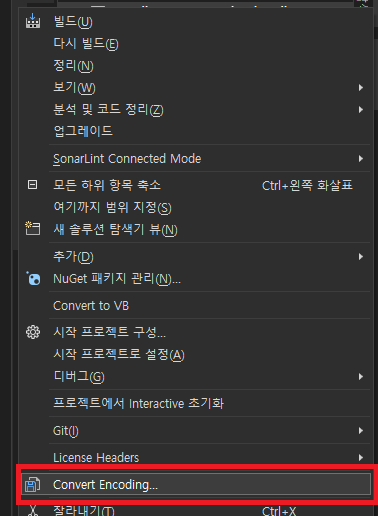

# Encoding Converter Visual Studio Extension
A Visual Studio extension that allows you to easily convert the encoding of multiple files(System Encoding / UTF-8 with / without BOM).

You can use this feature in Solution Explorer.

